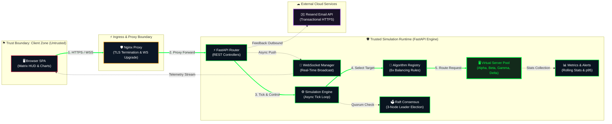
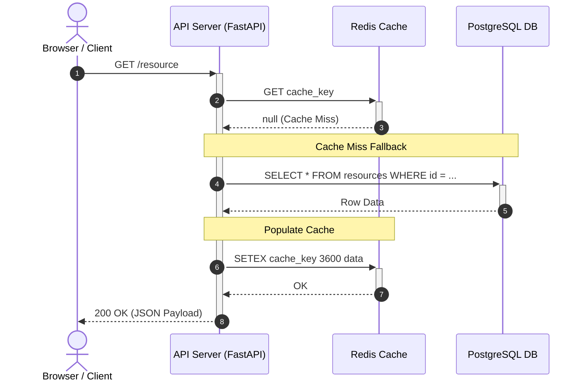

# ⬡ NEXUS — Smart Load Balancer Simulator

> A high-performance, real-time load balancing simulator with an immersive Matrix-themed cyberpunk dashboard. Visualize, benchmark, and stress-test 6 load balancing algorithms across dynamic server pools with real-time WebSocket telemetry.

<p align="center">
  <a href="https://nexus-load-balancer.onrender.com/" target="_blank">
    
  </a>
</p>

<p align="center">
  
  
  
  
  
  
</p>

---

## 🚀 Live Demo & Interactive Links
* **Live Web Application:** [https://nexus-load-balancer.onrender.com/](https://nexus-load-balancer.onrender.com/)
* **Interactive Architecture Diagram:** [nexus-architecture.html](./nexus-architecture.html)
* **Interactive Sequence Diagram:** [cache-miss-sequence.html](./cache-miss-sequence.html)
* **Archify Architecture Specification:** [nexus-architecture.json](./nexus-architecture.json)
* **Archify Sequence Specification:** [cache-miss-request.sequence.json](./cache-miss-request.sequence.json)

---

## 🎯 Overview

NEXUS is an end-to-end distributed system simulator built to demystify load balancing mechanics, fault tolerance, and consensus protocols:
- **Real-Time Traffic Dispatch:** Watch synthetic HTTP/API traffic distribute across server nodes via WebSockets at customizable rates (Slow, Normal, Heavy, Burst, Custom RPS).
- **6 Load Balancing Algorithms:** Seamlessly switch between Round Robin, Weighted Round Robin, Least Connections, IP Hash, Random, and Least Response Time on the fly.
- **Raft Consensus Control Plane:** 3-node distributed consensus cluster with real-time leader elections, heartbeats, and failover quorum protection.
- **Chaos & Fault Injection:** Inject server crashes, high latency spikes, and CPU/connection overloads to test cluster resiliency.
- **Auto-Scaling Engine:** Automatic scale-up/scale-down of virtual nodes based on moving-average CPU thresholds.
- **Live Metrics & Analytics:** Track rolling RPS, p95 response times, error rates, CPU load distribution, and alert conditions.
- **Zero Real Infrastructure Required:** Fully simulated in-memory async Python engine running with microsecond precision.

---

## 🏗️ High-Level Runtime Architecture

Generated using **Archify** principles (bounded scope, single primary path, verified trust boundaries, and detail cards).



> 💡 **Interactive Architecture Viewer:** Open [nexus-architecture.html](./nexus-architecture.html) in your browser to view the interactive diagram with full details for each component, trust boundary, and flow card.

---

## ⚡ Request Lifecycle Sequence (Cache Miss Flow)

Modeled in the [Archify Sequence Specification](./cache-miss-request.sequence.json):



> 💡 **Standalone Sequence Diagram:** View [cache-miss-sequence.html](./cache-miss-sequence.html) for the dedicated sequence rendering.

---

## 📁 Repository Structure

```
smart_load_balancer/
├── app/
│   ├── __init__.py
│   ├── main.py                     # FastAPI application, static mounting, lifecycles
│   ├── config.py                   # Pydantic settings & environment configuration
│   ├── core/
│   │   ├── simulation.py           # Simulation engine (async tick loop, traffic orchestration)
│   │   ├── server_node.py          # Virtual server node model (CPU, latency, connection tracking)
│   │   ├── request_model.py        # Synthetic request generator
│   │   ├── metrics.py              # Metrics collector (RPS, p95 latencies, error tracking)
│   │   ├── alerts.py               # Real-time alert manager & health rules
│   │   └── raft.py                 # 3-Node Raft consensus control plane simulation
│   ├── algorithms/
│   │   ├── base.py                 # Abstract base algorithm interface
│   │   ├── round_robin.py          # Round Robin
│   │   ├── weighted_round_robin.py  # Weighted Round Robin
│   │   ├── least_connections.py    # Least Connections
│   │   ├── ip_hash.py              # Client IP Hash
│   │   ├── random_choice.py        # Uniform Random
│   │   └── least_response_time.py  # Least Response Time
│   ├── api/
│   │   ├── simulation_routes.py    # Traffic modes, pause/play, spike controls
│   │   ├── server_routes.py        # Dynamic server CRUD & fault injection
│   │   ├── algorithm_routes.py     # Live algorithm switching
│   │   ├── metrics_routes.py       # Snapshot metrics, analytics, JSON export
│   │   ├── websocket_routes.py     # Full-duplex WebSocket real-time broadcast
│   │   └── feedback_routes.py      # User feedback with Resend mailer integration
│   └── utils/
│       ├── logger.py               # Colored console logger
│       └── mailer.py               # Resend API email utility
├── frontend/
│   ├── index.html                  # Matrix HUD Single Page Application
│   ├── css/
│   │   ├── main.css                # Matrix theme, cybernetic layout & variables
│   │   ├── components.css          # Glassmorphic cards, sliders, gauges, HUD buttons
│   │   └── animations.css          # Scanline, terminal flicker & neon glows
│   └── js/
│       ├── app.js                  # SPA routing and main controller
│       ├── websocket.js            # Resilient WebSocket client & reconnect logic
│       ├── dashboard.js            # Real-time server grid & active stream view
│       ├── servers.js              # Server control panel & fault injection tools
│       ├── algorithms.js           # Live algorithm benchmark & comparison
│       ├── logs.js                 # Terminal log feed
│       ├── analytics.js            # Historical performance telemetry
│       ├── settings.js             # Simulation tick rate, auto-scaling thresholds
│       └── charts.js               # Chart.js time-series charts
├── config/
│   └── defaults.json               # Default server configs & simulation parameters
├── nexus-architecture.html         # Archify rendered interactive architecture diagram
├── nexus-architecture.json         # Archify typed architecture JSON specification
├── cache-miss-sequence.html        # Rendered sequence diagram (cache miss flow)
├── cache-miss-request.sequence.json# Archify sequence JSON specification
├── docker-compose.yml              # Local container orchestrator
├── Dockerfile                      # Production container image
├── requirements.txt                # Python dependencies
├── run.py                          # Local server launcher
└── README.md
```

---

## ⚙️ Quickstart & Local Installation

### Prerequisites
- Python 3.10+
- `pip` and `virtualenv`

### 1. Clone & Setup
```bash
git clone https://github.com/DownshifterX/smart_load_balancer.git
cd smart_load_balancer
```

### 2. Virtual Environment
```bash
# Windows
python -m venv venv
venv\Scripts\activate

# Linux / macOS
python3 -m venv venv
source venv/bin/activate
```

### 3. Install Dependencies
```bash
pip install -r requirements.txt
```

### 4. Configuration (Optional)
```bash
cp .env.example .env
# Configure custom tick rates, default algorithms, or optional RESEND_API_KEY
```

### 5. Launch
```bash
python run.py
```
Open your browser to **http://localhost:8000** to enter the NEXUS Cyber Dashboard.

---

## 🎮 Dashboard & Simulation Controls

### Keyboard Shortcuts
* `Space` — Start / Stop simulation loop
* `1` - `6` — Switch views (Dashboard, Servers, Algorithms, Logs, Analytics, Settings)

### Traffic Profiles
| Mode | Traffic Intensity | Behavior |
|---|---|---|
| **STOPPED** | 0 req/sec | Standby / paused |
| **SLOW** | 1 req/tick (~2 RPS) | Low-density testing |
| **NORMAL** | 3 req/tick (~6 RPS) | Steady-state load |
| **HEAVY** | 8 req/tick (~16 RPS) | Stressed conditions |
| **BURST** | 20 req/tick (~40 RPS) | Spike overload testing |
| **CUSTOM** | 1 - 100 RPS | Granular slider control |

### Chaos Engineering & Fault Injection
- **Kill Server:** Simulates an abrupt unrecoverable node crash (`500 Internal Error`).
- **High Latency Injection:** Adds synthetic latency (200ms–800ms) to test queue backpressure.
- **Connection Overload:** Spikes active sockets to max limit to trigger connection rejection.
- **Raft Leader Kill:** Kills the elected consensus leader node to watch live failover and election term increment.

---

## ⚖️ Supported Load Balancing Algorithms

1. **Round Robin (`round_robin`)**  
   Sequentially steps through available active nodes in cyclical order.
2. **Weighted Round Robin (`weighted_round_robin`)**  
   Distributes traffic proportionally based on assigned server weight capacities.
3. **Least Connections (`least_connections`)**  
   Selects the server currently managing the fewest concurrent active sockets.
4. **IP Hash (`ip_hash`)**  
   Computes a deterministic hash of the client IP address for consistent routing.
5. **Uniform Random (`random_choice`)**  
   Distributes traffic purely pseudorandomly across healthy nodes.
6. **Least Response Time (`least_response_time`)**  
   Routes traffic to the node exhibiting the lowest moving-average latency and fewest connections.

---

## 🐳 Docker Deployment

Run anywhere with zero dependencies:

```bash
# Using Docker Compose
docker-compose up --build

# Or standard Docker build
docker build -t nexus-load-balancer .
docker run -p 8000:8000 nexus-load-balancer
```

---

## 📡 API Reference Summary

| Endpoint | Method | Functionality |
|---|---|---|
| `/api/simulation/start` | `POST` | Resumes synthetic traffic generation |
| `/api/simulation/stop` | `POST` | Pauses simulation engine |
| `/api/simulation/reset` | `POST` | Resets metrics and node counts to initial defaults |
| `/api/simulation/traffic` | `POST` | Sets traffic profile (`slow`, `normal`, `heavy`, `burst`, `custom`) |
| `/api/simulation/spike` | `POST` | Injects an instant burst of 50 concurrent requests |
| `/api/servers` | `GET` / `POST` | Lists all server nodes or registers a new server |
| `/api/servers/{id}/toggle` | `POST` | Enables / disables health status for a specific node |
| `/api/servers/{id}/simulate-failure` | `POST` | Injects crash, latency, or overload conditions |
| `/api/algorithms` | `GET` | Returns all 6 algorithm strategies and metrics |
| `/api/algorithms/switch` | `POST` | Dynamically switches the active routing algorithm |
| `/api/metrics` | `GET` | Fetches snapshot of RPS, latency percentiles, and errors |
| `/api/metrics/export` | `GET` | Downloads current performance metrics as JSON |
| `/api/feedback` | `POST` | Dispatches feedback email to administrator via Resend |
| `/ws` | `WebSocket` | Full-duplex live telemetry and event stream |

Interactive Swagger documentation available at `/docs` when running.

---

## 📚 Technical Documentation & Citations

For academic evaluation and systems design references, consult [references.txt](./references.txt) for complete IEEE-formatted citations covering distributed load balancing, consensus theory, and reverse proxy architectures.

---

<p align="center">
  <b>NEXUS Smart Load Balancer Simulator</b> • Built for Distributed Systems Visualization
</p>
